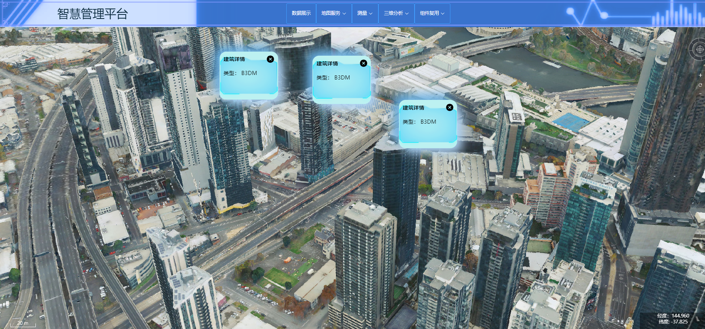

# 城市可视化平台
、
## 项目简介
该项目技术选型 ： vue + element + axios + echarts + cesium，主要实现了数据展示，地图服务，测量，三维分析，组件复用五大模块
数据展示模块由echarts图表可视化实现;
地图服务模块实现了WMS,WMTS，天地图注解，高德影像加载;
测量模块实现了直线测量，面积测量;
三维分析模块实现了通视分析，剖面分析，淹没分析，高程分析，地形开挖，单体化功能;
组件复用模块封装了弹窗组件，卷帘组件，鹰眼组件

### 数据展示

### 地图服务

### 测量
直线测量

面积测量

### 三维分析
剖面分析

淹没分析

高程分析

地形开挖

单体化

### 组件复用
弹窗组件

卷帘组件

鹰眼组件
